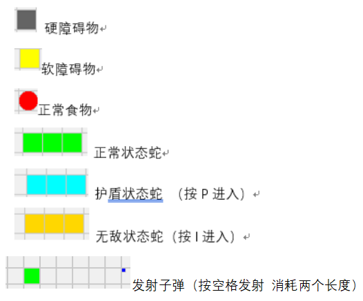

# SnakegamePlayer 1.0
## 基本玩法介绍
- 具有一般的贪吃蛇玩法，吃食物变长，蛇头撞击板边和蛇身体即game over
- 具备一些特殊的创新玩法 如障碍物（hard 、soft） 子弹技能、无敌技能、护盾技能
- WASD控制蛇改变方向 同向和反向没有效果
- game over后 R可以重新开始并重置地图
## 创新玩法说明
1. 蛇撞软障碍物会减少自身长度1，撞硬障碍物会直接去世
2. 护盾技能能抵消一次软障碍物撞击的减少长度以及一次自己撞自己，但是无法抵消撞击硬障碍物，硬障碍物只能用子弹或者无敌技能去躲避
3. 无敌可以穿透硬障碍物，穿透自身蛇体 以及撞击软障碍物而不损失长度
4. 无敌和护盾状态下均可正常吃食物成长
5. 长度低于2时不能发射子弹
6. 长度为1时装上软障碍物会死亡
7. 无敌状态撞板边依然会死
8. 子弹可以消除各种障碍物
9. 无敌时间为5s 护盾可长久存在直到被消耗（撞软障碍物或者蛇身） 
---

---